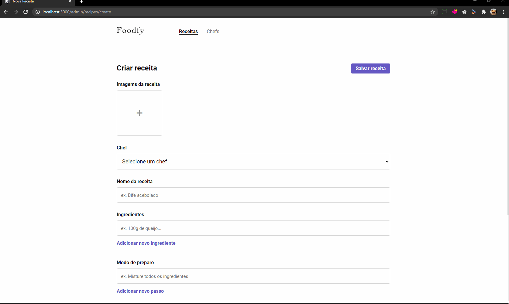
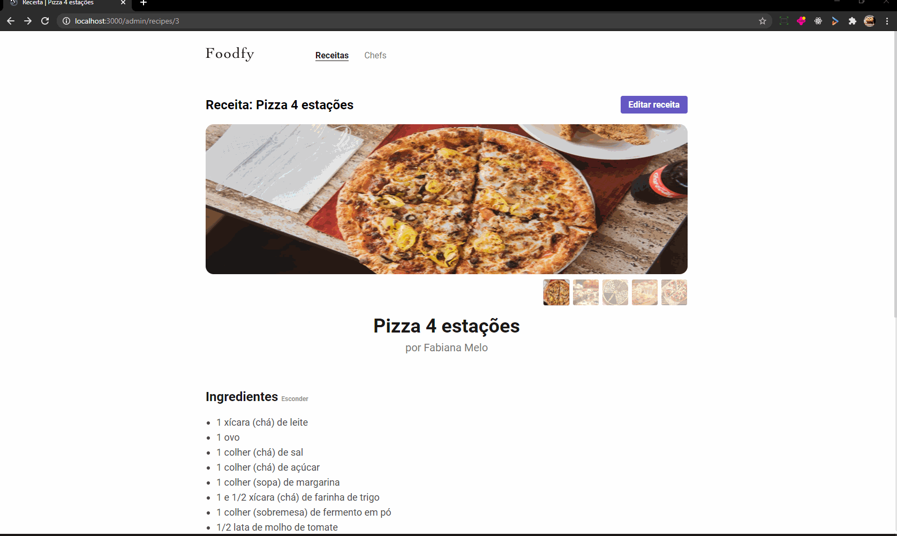

<h1 align="center">
    
</h1>   
   
## ℹ Sobre

Este projeto faz parte dos desafios do bootcamp LaunchBase realizado pela Rocketseat, o Foodfy é um site de receitas e chefs.

foi adicionada uma área administrativa para gerenciar as receitas e os chefs podendo adicionar editar ou deletar tanto as receitas quanto os chefs

Mais um update agora foi adicionada a funcionalidade para fazer o upload de imagens das receitas quanto dos chefs usando multer

</br>

Foodfy
</br>


</br>
</br>

Admin foodfy
</br>


</br>
</br>

Upload de imagens


</br>
</br>


</br>
</br>

## 🚀 Tecnologias utilizadas:

- CSS
- HTML
- JavaScript
- Node.Js
- PostgreSQL

</br>

## 💻 Como utilizar

```bash

# clonar o repositório
$ git clone https://github.com/ivopereira-jr/Foodfy.git

# instalar as dependências
$ yarn install
$ npm install

# para iniciar
$ yarn start
$ npm start

```

---

## ⚙ configurações

configurar o arquivo db.js na pasta config de acordo com o seu gerenciador de banco de dados
</br>
configurar o arquivo mailer.js na pasta lib para o envio de emails para senhas e recuperação de senhas eu utilizei o mailtrap para receber esses emails

- Utilize o arquivo foodfydb.sql para criação do banco de dados

</br>

## 💬 Vamos trocar ideias

[_Entre em contato comigo_](https://www.linkedin.com/in/ivo-pereira-3997911a8)

Obrigado por chegar até aqui! 💜
